# ANUFS BSPD 2026

**Brake System Plausibility Device — analog detection, timed qualification, latched shutdown.**

This board monitors two throttle-position signals (TPS1/TPS2) and brake pressure (BPS). A persistent sensor-range fault, or sustained hard braking with throttle above 10%, removes the board's supply to the vehicle shutdown circuit.

## System architecture

## How a trip happens

1. **Condition the inputs.** TVS Diodes protect the sensor lines; pull-downs bias disconnected inputs low, as required by rules. R1/C2, R10/C3 and R15/C5 RC filter TPS1, TPS2 and BPS, respectively (5.49 kΩ / 1 µF).
2. **Check two independent fault paths.** U2/U4 compare each sensor with `V_THL` and `V_THH`. In parallel, U1 detects hard braking **AND** either TPS channel above its calibrated 10% threshold. TPS2 uses the opposite comparator polarity to TPS1, matching the schematic's opposite sensor slopes.
3. **Require persistence.** U3 qualifies each sensor-range fault for approximately **100 ms**, or `HB&10%` for approximately **1 second**. A brief excursion that recovers sufficiently before the timing threshold does not trip the latch; RC history affects closely spaced excursions.
4. **Latch the fault.** U3's open-collector outputs share `FAULT`. Any qualified fault pulls this normally high net low, asserting U5's asynchronous clear. U5 Q falls and stays low after the original fault disappears.
5. **Remove shutdown-circuit power.** Low `OUTPUT` turns Q1 off; R30 pulls Q2's gate toward its source, turning the P-channel switch off. The board stops supplying +12 V to `SC_OUT` on J1 pin 5. External vehicle circuitry determines the resulting shutdown action.

### Operating states

| Condition | Qualified `FAULT` | U5 Q / `OUTPUT` | `SC_OUT` supply |
|---|---|---|---|
| Initialized, healthy, no previous trip | High | High | Enabled |
| Fault present, timer has not reached threshold | High | Remains high if previously enabled | Enabled |
| Either fault path reaches its timer threshold | Low | Forced low | Disabled |
| Sensor condition recovers after a trip | Returns high after timer recovery | Remains low | Disabled |
| Power cycled with faults absent | Power-on preset initializes U5 | Returns high | Enabled after initialization |

The U7 Schmitt-trigger circuit with R32/C19/C20 generates the power-on preset. This design does not use a software reset or automatically re-enable just because a fault clears.

## Supporting circuits

| Block | Implementation |
|---|---|
| Logic supply | U6 LM1117-5.0 regulates +12 V to +5 V; D5 provides supply transient suppression. |
| Sensor limits | SW1/SW2 select fixed or variable window references. Fixed net names are `+0V45` and `+4V7`; RV4/RV5 provide adjustable alternatives. |
| Operating thresholds | RV1 sets `HB_THRESH`; RV2/RV3 set `TPS1_THRESH` / `TPS2_THRESH`. Calibrate these against the actual sensors. |
| Timing reference | `+2V5` feeds U3; sensor timers use 150 kΩ / 1 µF; overlap timing uses R7 + R8 = 300 kΩ with C1 = 4.7 µF. |
| Indicators | U8/U9 buffer condition indicators D10–D15. U5's complementary output drives latch indicator D9 through R39. |

### J1 interface

| Pin | Net | Role |
|---|---|---|
| 1 | `+12V` | Board and switched-output supply |
| 2 | Unconnected | No connection |
| 3 | `GND` | Board ground |
| 4 | `/SENS_0V` | Sensor return, joined to GND through R46 (0 Ω) |
| 5 | `SC_OUT` | Switched shutdown-circuit supply |
| 6 | `BPS_RAW` | Brake-pressure input |
| 7 | `TPS2_RAW` | Throttle-position channel 2 |
| 8 | `TPS1_RAW` | Throttle-position channel 1 |

## Design files

- [KiCad project](bspd-kicad/bspd.kicad_pro)
- [Schematic](bspd-kicad/bspd.kicad_sch)
- [PCB layout](bspd-kicad/bspd.kicad_pcb)
- [Bill of materials](BSPD_DigiKey_BOM.xlsx)

## Attrobitom

Animation generated using [Dashmotion](https://github.com/csthink/dashmotion) (MIT); attribution is retained in [docs/DASHMOTION-LICENSE.txt](docs/DASHMOTION-LICENSE.txt). The diagram assets have no external runtime dependencies.
